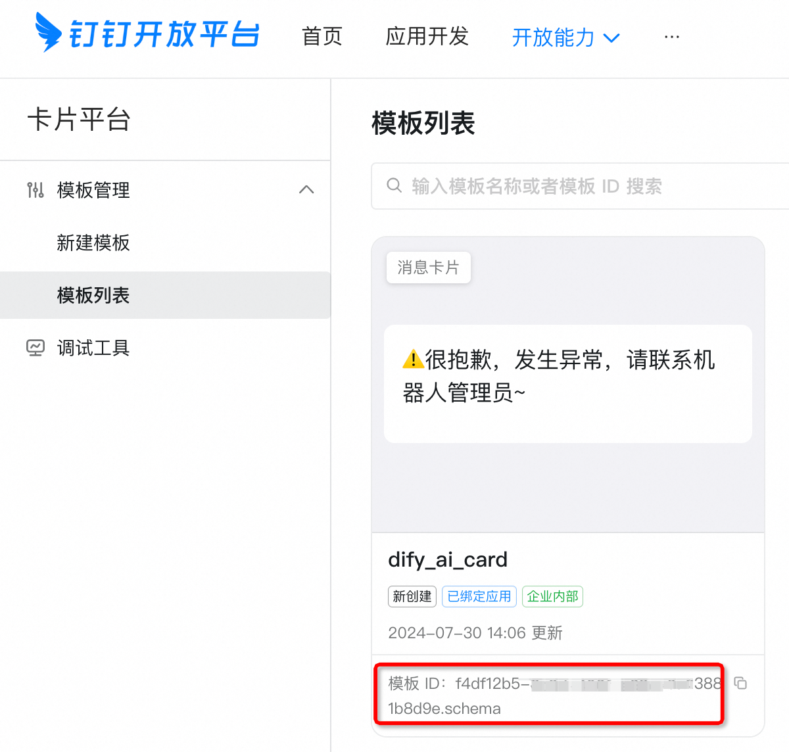
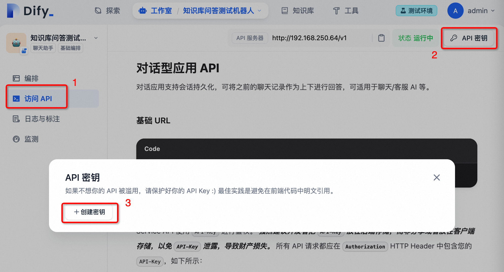

# Dify on Dingtalk


## 简介

Dify-on-Dingtalk 是一个非常轻量级的 Dify 的钉钉机器人集成方案。可以通过简单配置来对接你的Dify应用和企业内部机器人，实现企业内部机器人的群聊、私聊智能问答。尤其是支持钉钉的AI卡片流式打字机输出效果。

支持功能：

- [x] AI会话卡片消息流式输出
- [x] 对接dify聊天助手应用
- [x] 对接dify工作流应用
- [x] 对接dify文本生成应用
- [x] 支持单聊中的会话上下文
- [x] 支持群聊中的会话上下文（目前上下文维持在用户级别，即群内每个用户分别享有自己的会话上下文）
- [ ] 支持接受钉钉图片消息为输入
- [ ] 支持输出图片消息

> [!NOTE]
> 目前经过测试的dify版本在0.6.13，估计0.6.x版本应该都可以。

## 更新日志

- 2024-08-19 v0.1：第一个版本上线。

## 准备工作

### 钉钉开放平台准备

#### 1. 创建企业内部钉钉机器人

参考[创建企业内部应用机器人](https://open.dingtalk.com/document/orgapp/the-creation-and-installation-of-the-application-robot-in-the)
创建企业内部钉钉机器人，注意消息接收模式设置为**stream模式**，并且给机器人添加权限，确保机器人可以发送消息。


然后记录该应用的应用ID(client_id)和应用密钥(client_secret)。

#### 2. 创建AI卡片模板

进入钉钉开发者后台[卡片平台](https://open-dev.dingtalk.com/fe/card)
新建一个AI卡片模板，卡片类型选择消息卡片，卡片模板场景选择 AI卡片，并关联上边创建的应用。
然后可以在卡片模板中设置AI卡片的模板，例如：

todo 图片

记录该卡片模板的模版ID。



### Dify应用准备

给要集成的Dify应用生成API密钥。

> [!IMPORTANT]
> 对于工作流和文本生成类型的应用，本项目约定需要用户输入的输入变量只有1个且命名为query。因为钉钉对话场景下用户输入是单条消息，所以这里只能设置一个变量。



## 快速开始

### 获取代码

```shell
git clone https://github.com/zfanswer/dify-on-dingtalk.git
# 有网络问题的可以从gitee镜像仓库拉取
# git clone https://gitee.com/zfanswer/dify-on-dingtalk.git
```

### 利用Docker启动服务

```shell
cd docker
cp ../.env.example .env
cp ../.bots.yaml.example .bots.yaml
# 分别修改.env和.bots.yaml文件，配置好所需参数。
docker-compose up -d
```

### 从源码启动服务

- python 3.10+

```shell
cd dify-on-dingtalk
# 最好是在虚拟环境中运行
pip install -r requirements.txt

cd dod
cp .env.example .env
cp .bots.yaml.example .bots.yaml
# 分别修改.env和.bots.yaml文件，配置好所需参数。

python app.py
```

### .env配置说明

.env文件不存在或者不设置这些变量程序也可以正常启动，但是不一定能正常进行问答。

| 参数                            | 说明                                                                                   | 默认值                   |
|-------------------------------|--------------------------------------------------------------------------------------|-----------------------|
| LOG_LEVEL                     | 输出log级别                                                                              | INFO                  |
| DEFAULT_MAX_WORKERS           | 默认对每个bot启动的监听线程数，调高可以提高并发，不过由于线程不会释放所以需要谨慎调高。这里只是默认值，每个bot具体的线程数可以在.bot.yaml文件中分别调整。 | 2                     |
| DIFY_OPEN_API_URL             | Dify api的地址，在应用的api页面中可以查看到，默认是Dify saas服务地址。                                        | https://api.dify.ai/v1 |
| DIFY_CONVERSATION_REMAIN_TIME | 会话过期时间，超过这个时间会自动结束会话，单位是分钟。                                                          | 15                    |
| DINGTALK_AI_CARD_TEMPLATE_ID  | 钉钉AI卡片模板的模版ID，可以在卡片平台中获取，必须使用这个才可以流式输出。                                              |                       |

### .bots.yaml配置说明

该文件内部是多个钉钉机器人bot配置的列表，可以配置多个钉钉机器人，每个机器人可以匹配1个Dify应用。
每个bot的配置项是相同的，下边是各配置项说明。

| 参数                         | 说明                                                                                  | 必须与否 |
|----------------------------|-------------------------------------------------------------------------------------|------|
| name                       | 机器人名称，用于区分不同的机器人。                                                                   | 是    |
| dingtalk_app_client_id     | 钉钉开放平台应用的client_id，可以在钉钉开放平台中获取。                                                    | 是    |
| dingtalk_app_client_secret | 钉钉开放平台应用的client_secret，可以在钉钉开放平台中获取。                                                | 是    |                |      |
| dify_app_type              | 对应Dify应用类型聊天助手、工作流、文本生成。须用这3项之一：chatbot, completion, workflow，参考下图，AGENT也算做chatbot。 | 是    |
| dify_app_api_key           | 对应Dify应用的api_key，可以在应用的api页面中获取。                                                    | 是    |
| handler                    | handler类名。                                                                          | 是    |
| max_workers                | 该机器人监听的线程数，不填写默认使用.env中的DEFAULT_MAX_WORKERS配置。                                      | 否    |                                                                             | 否    |


## 声明

本项目参考多个项目，感谢原作者。

- [Dify python client](https://github.com/langgenius/dify/tree/main/sdks/python-client)
- [钉钉开放平台-打字机效果流式AI卡片](https://open.dingtalk.com/document/isvapp/typewriter-effect-streaming-ai-card)
- [chatgpt-on-wechat](https://github.com/zhayujie/chatgpt-on-wechat)